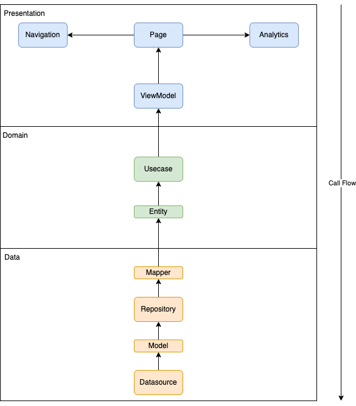
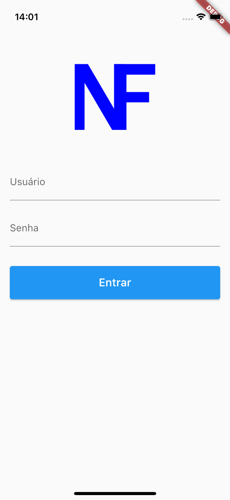
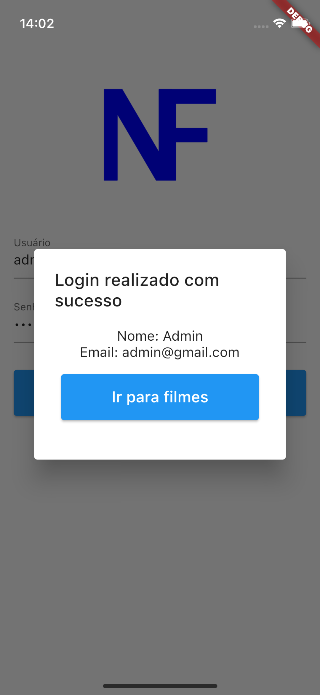
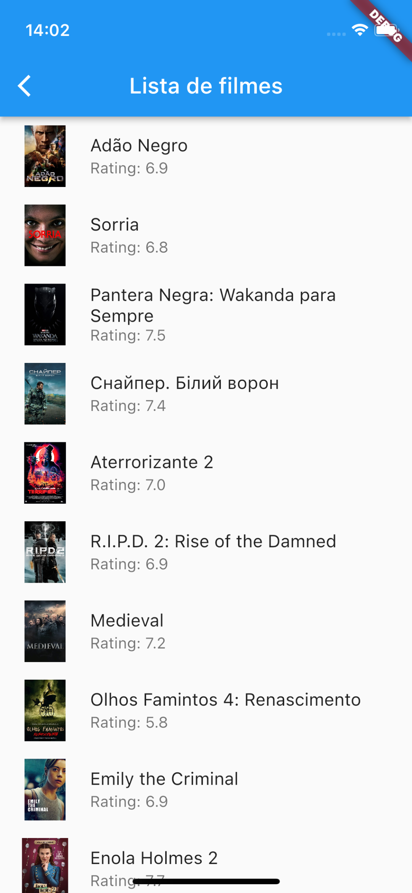
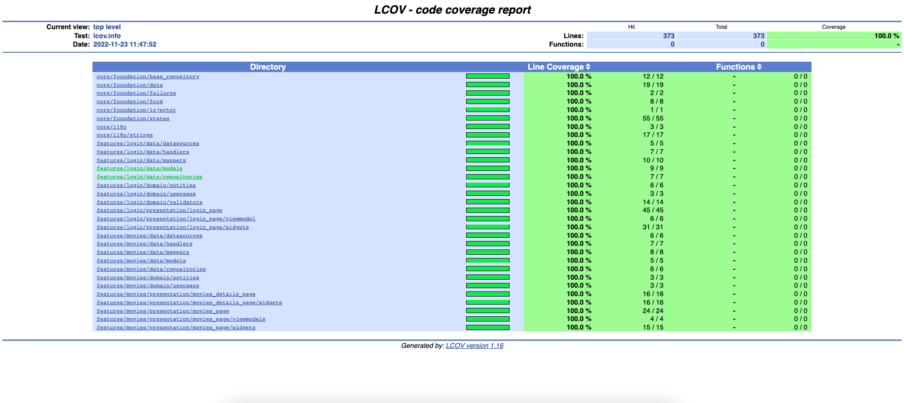

# flutter_clean_next


App de exemplo utilizando de uma Arquitetura própria desenvolvida, utilizando de Clean Architecture, ChangeNotifier, bem como, arquivos criados para auxiliar no desenvolvimento.

## Versão

* Flutter: 3.3.7

## Arquitetura
<p align="center">

</p>

### Camadas

#### Core

Nesta camada é onde fica todos os arquivos que possam ser reutilizados nas features, tornando o projeto mais manutenível e legível.

#### Data

Camada que hospeda classes que adequam os dados externos para a utilização nas regras de negócios.

##### Models

É aqui que estão os Models relacionados com o mundo exterior, nesses Models estão presentes os métodos fromJson e toJson.

##### Datasources

Nesta camada terá a interface e a implementação do Datasource em arquivos separados. 
Esta camada é encarregada de:
1. Fornecer os dados solicitados.
2. Solicitações de dados para APIs.
3. Fazer os fromJson e toJson dos Models.
4. Lançamento de exceções que poderão ser ocasionadas pela chamada de API.

##### Mappers

Esta camada é onde será feito as conversões das Entities e Models.
Criado para que não tenha a conversão de Entities e Models dentro da própria classe. 
Esta camada é encarregada de:
1. Converter os Models para Entities ou vice-versa. 
2. Converter os atributos caso necessário.

##### Repositories

Nesta camada terá a implementação do Repository.
Todos os repositórios devem estender do BaseRepository. 
Esta camada é encarregada de:
1. Se comunicar com o DataSource.
2. Converter o Model para Entity ou vice-versa. 
3. Formatações necessárias.

#### Domain

Camada que hospeda classes com regras de negócios da aplicação.

##### Entities

Classe que representa um objeto, seja a ser enviado (input) ou recebido (output).
Ela está relacionado ao que pode ser apresentado na tela, podendo ou não refletir a resposta do serviço.

##### Repositories

Na camada de repositories dentro do Domain teremos que ter apenas o contrato das interfaces(Abstrações) e a responsabilidade de implementação desse objeto deverá ser repassado a outra camada mais baixa, que será no Data.

##### Usecases

Camada responsável pelas regras de negócio da aplicação. 
Padrões da camada usecase:
1. Nesta camada vão ser vários usecases para cada feature.
2. Dentro de cada usecase terá só um método chamado call().
3. A ideia é que ele trate o pedido do presenter, faça validações e tratamentos dos inputs e, posteriormente encaminhe para a próxima camada (repository). 
4. A resposta recebida terá o mesmo cuidado de acordo com cada regra de negócio.

#### Presentation

Camada que cuida da parte visual da aplicação.

##### ViewModel

ViewModel é usado para transferir dados entre View e Model. Nesta camada é feito o gerenciamento de estado utilizando o padrão ViewState.

##### Pages

Em pages é implementado os artefatos visuais (header, botões, temas, textos, etc). Padrões:
1. Usar widgets (stateless ou stateful) separados em vez de métodos privados na mesma page 
2. Não colocar informações de texto na tela e sim adicionar Internacionalização.
3. Todo onClick tem que ser uma função privada separada da tela.

##### Widgets

Camada para criar os widgets separados da Page.

## Telas
O App possuí 3 telas.

#### Login

<p align="center">

</p>

<p align="center">

</p>


#### Movies

<p align="center">

</p>


#### MoviesDetails

<p align="center">

</p>

### Testes unitários

Foram realizados testes unitários, deixando assim, o projeto com 100% de cobertura.

Testes realizados:

* Datasources
* Repository
* Models
* Mappers
* Usecases
* Validators (Validadores de Formulário)
* ViewModels
* Widgets

<p align="center">

</p>

#### Rodar Coverage
```shell
./coverage_report.sh
```

**OU**

```dart
flutter test --coverage
```
```dart
lcov --remove coverage/lcov.info \
'lib/main.dart' \
'lib/*/*.g.dart' \
-o coverage/lcov.info
```